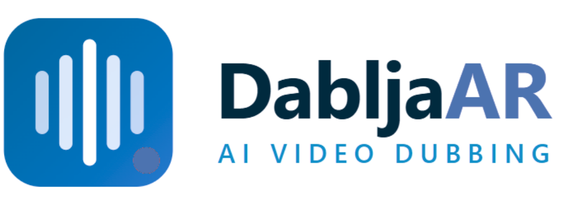
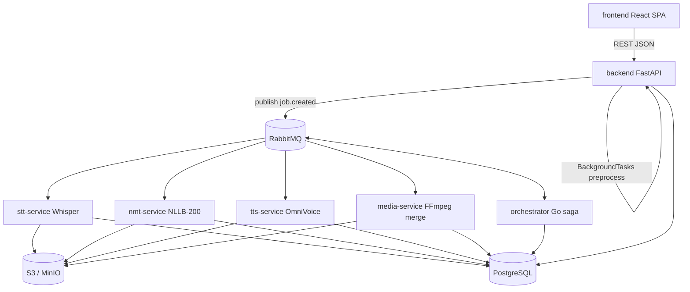

<div align="center">
  

  <h3>AI-Powered Video Dubbing — Caption, Translate, and Re-Voice Content into Natural Arabic</h3>
</div>

**DabljaAR** is an AI-powered video dubbing platform that automatically transcribes, translates, and re-voices video content from English into natural Arabic speech. The platform replaces manual dubbing workflows with an end-to-end automated pipeline built on speech recognition, neural machine translation, and neural text-to-speech synthesis.

Users upload video, audio, or text (including YouTube links), choose an output mode, and receive captioned, translated, or fully dubbed results — all tracked through a web dashboard with real-time job status polling.

---

## Table of Contents

- [Overview](#overview)
- [System Architecture](#system-architecture)
- [Core Pipeline Modules](#core-pipeline-modules)
- [Tech Stack](#tech-stack)
- [Repository Structure](#repository-structure)
- [Getting Started](#getting-started)
- [Production](#production)
- [Documentation](#documentation)
- [Future Work](#future-work)

---

## Overview

DabljaAR is built around a single user flow that moves from content upload to AI-processed output:

1. **Register / sign in** — JWT-based authentication with subscription and credit tracking.
2. **Upload content** — video, audio, text, or a YouTube URL via the dashboard.
3. **Choose output type** — one of four pipeline modes (see below).
4. **Track progress** — the frontend polls job status while the backend orchestrates async processing.
5. **Download results** — captions, translated transcripts, synthesized audio, or a fully dubbed video.

### Output modes

| Mode | Pipeline stages | Result |
|---|---|---|
| `captionsOnly` | STT | English transcript / captions |
| `captionsAndTranslation` | STT → NMT | Arabic transcript alongside original |
| `translationAndTTS` | NMT → TTS | Arabic speech synthesis from text |
| `fullDubbing` | STT → NMT → TTS → merge | Complete dubbed video with replaced audio track |

Media preprocessing (audio extraction, thumbnail generation) runs in the **backend** before the orchestrator takes over the AI pipeline.

---

## System Architecture

DabljaAR uses an **event-driven microservices architecture**: a Go orchestrator coordinates pipeline stages over **RabbitMQ**, with each AI stage running as an independently deployable Python worker. Inter-stage messages carry only a job ID (claim-check pattern) — workers load full input from PostgreSQL and S3.



For detailed service contracts, queue topology, and message schemas, see [`docs/microservices_lld.md`](docs/microservices_lld.md).

---

## Core Pipeline Modules

### Orchestrator (`orchestrator/`)

Go-based saga coordinator and pipeline state machine. Listens for `job.created` events, creates child stage jobs, publishes `job.start.*` commands, and advances the pipeline on `job.results.*` responses. Handles cancellation, retries, and dead-letter routing. Does not perform any AI inference.

### STT — Speech-to-Text (`stt-service/` :8001)

Transcribes uploaded audio using **faster-whisper**. Loads media from S3, segments the transcript with timestamps, and writes results to the database. Model weights are resolved from local cache → S3 → HuggingFace fallback.

### NMT — Neural Machine Translation (`nmt-service/` :8002)

Translates STT segments from English to Arabic using **NLLB-200**. Internal fan-out: one AMQP message in, all segments translated in a bounded thread pool, one result out. Optional Groq-powered length adjustment for timing alignment. Multi-stage fallback pipeline for translation quality.

### TTS — Text-to-Speech (`tts-service/` :8005)

Synthesizes Arabic speech from translated segments using **OmniVoice / silma-tts**. Internal fan-out per segment, then audio combine (stretch, fit, concat with silence gaps) into a single WAV uploaded to S3. Also exposes a standalone `POST /synthesize` HTTP endpoint.

### Media Merge (`media-service/` :8003)

FFmpeg-based final mux for `fullDubbing`: replaces the original video's audio track with the combined TTS output. No ML model — pure media processing. Reads `combined_audio_key` from the database and uploads the dubbed video to S3.

### Backend API (`backend/` :8000)

FastAPI application serving as the **API gateway and domain layer**: authentication, user management, subscriptions, media upload/preprocess, job creation, and status polling. After preprocessing, publishes `job.created` to RabbitMQ to kick off the pipeline.

---

## Tech Stack

| Layer | Technologies |
|---|---|
| **Frontend** | React 19, Vite, Zustand, React Router 7, Tailwind CSS 4, Vitest |
| **API Gateway** | FastAPI, SQLAlchemy, Alembic, asyncpg, Pydantic v2, JWT auth |
| **Orchestrator** | Go, GORM, RabbitMQ client |
| **STT** | faster-whisper, Python 3.12 |
| **NMT** | NLLB-200 (transformers), optional Groq API |
| **TTS** | OmniVoice / silma-tts, PyTorch |
| **Media** | FFmpeg |
| **Messaging** | RabbitMQ (topic exchange `dablja.jobs.exchange`) |
| **Database** | PostgreSQL 16 |
| **Storage** | S3-compatible (MinIO locally, GCS/S3 in production) |
| **Infra** | Docker Compose, Caddy, Terraform (GCP), GitHub Actions |

---

## Repository Structure

```
web/
├── frontend/                  # React SPA — landing, dashboard, auth, job polling
├── backend/                   # FastAPI API gateway — auth, media, jobs, billing
├── orchestrator/              # Go saga coordinator (RabbitMQ pipeline state machine)
├── stt-service/               # Speech-to-Text worker (faster-whisper)
├── nmt-service/               # Neural Machine Translation worker (NLLB-200)
├── tts-service/               # Text-to-Speech worker (OmniVoice)
├── media-service/             # FFmpeg merge worker (dubbed video mux)
├── libs/
│   └── dablja-worker/         # Shared Python AMQP consumer library
├── docs/                      # Architecture, API, deployment, runbook
├── infra/                     # Terraform (GCP VM, networking)
├── docker-compose.yml         # Local dev — full microservices stack
├── docker-compose.microservices.prod.yml  # Production compose
└── start.sh                   # Native dev bootstrap script
```

Each AI service follows the same pattern: FastAPI health/readiness endpoints + RabbitMQ consumer loop via `dablja-worker`, with stage-specific model and business logic in `app/`.

---

## Getting Started

### Native dev (Ubuntu 22.04)

```bash
git clone <repo-url> web
cd web
./start.sh setup
./start.sh run
```

Useful commands:

```bash
./start.sh status
./start.sh logs backend
./start.sh logs all
./start.sh stop
```

Access the frontend at `http://localhost:5173` and the backend API at `http://localhost:8000`.

### Docker Compose

```bash
docker compose up --build
```

This starts the full stack: PostgreSQL, RabbitMQ, MinIO, backend, orchestrator, all four AI workers, and the frontend.

See [`docs/onboarding.md`](docs/onboarding.md) for prerequisites, environment variables, and manual setup.

---

## Production

```bash
cp .env.production.example .env.production
# Edit .env.production: DOMAIN, secrets, RABBITMQ_URL, S3 credentials

docker compose --env-file .env.production \
   -f docker-compose.microservices.prod.yml up -d --build
```

Production deploys to GCP via GitHub Actions ([`.github/workflows/deploy-gcp.yml`](.github/workflows/deploy-gcp.yml)). See [`docs/deployment.md`](docs/deployment.md) for full configuration.

Legacy Celery stack (deprecated): `docker-compose.prod.minimal.yml`.

---

## Documentation

Detailed technical docs live in [`docs/`](docs/):

- [`docs/microservices_lld.md`](docs/microservices_lld.md) — service specs, queues, message contracts
- [`docs/microservices_migration.md`](docs/microservices_migration.md) — migration design and phased rollout
- [`docs/architecture.md`](docs/architecture.md) — system design overview
- [`docs/api.md`](docs/api.md) — API endpoint reference
- [`docs/onboarding.md`](docs/onboarding.md) — new developer setup guide
- [`docs/deployment.md`](docs/deployment.md) — deployment guide and environment config
- [`docs/runbook.md`](docs/runbook.md) — operations and troubleshooting
- [`docs/pipeline.md`](docs/pipeline.md) — AI dubbing pipeline details
- [`docs/gpu_setup.md`](docs/gpu_setup.md) — GPU acceleration for AI workers

---

## Future Work

- **Kubernetes deployment** — KEDA-autoscaled AI workers, HPA for API/orchestrator, shared model-cache PVCs
- **Database-per-service** — Phase 3 data ownership split for independent service scaling
- **Real-time job progress** — WebSocket or SSE push instead of frontend polling
- **Multilingual support** — extend NMT/TTS beyond English-to-Arabic
- **Additional output modes** — live captioning, partial pipeline re-runs