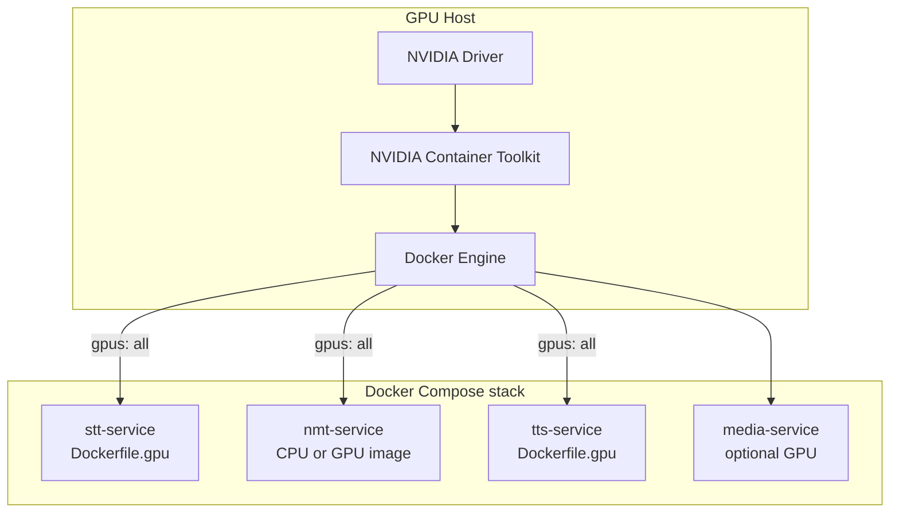

# GPU Setup Plan for AI Microservices

This document is a step-by-step plan to enable NVIDIA GPU acceleration for the DabljaAR AI pipeline on **bare metal**, **local Docker**, and **GCP (Terraform)** hosts.

It covers host drivers, Docker / Compose overlays, runtime environment variables, Terraform compute settings, validation, and troubleshooting.

---

## 1. Goals and scope

### What GPU accelerates

| Service | Model | GPU benefit | CPU fallback |
|---------|-------|-------------|--------------|
| **stt-service** | faster-whisper (Whisper) | High — 20s audio can drop from minutes to seconds | Yes (`STT_DEVICE=cpu`) |
| **tts-service** | OmniVoice | High — synthesis is the slowest stage in full dubbing | Yes (`OMNIVOICE_DEVICE=cpu`) |
| **nmt-service** | NLLB-200 | Moderate — auto-uses CUDA when torch sees a GPU | Yes (CPU torch in default image) |
| **media-service** | FFmpeg mux only | Optional — NVENC/NVDEC via `Dockerfile.gpu` | Yes (CPU FFmpeg) |

Services that **do not** need GPU: `backend`, `orchestrator`, `postgres`, `rabbitmq`, `caddy`.

### Target outcomes

- Whisper STT runs on CUDA inside the container.
- OmniVoice TTS runs on CUDA inside the container.
- NMT uses GPU when a CUDA PyTorch wheel is present.
- Docker Compose passes GPU devices into worker containers.
- GCP VM is provisioned with a GPU, NVIDIA drivers, and NVIDIA Container Toolkit.

---

## 2. Current repository state

Understanding what already exists avoids duplicate work.

### Dockerfiles

| Path | Purpose |
|------|---------|
| [stt-service/Dockerfile](../stt-service/Dockerfile) | CPU torch via [libs/docker-torch/install_cpu.sh](../libs/docker-torch/install_cpu.sh) |
| [stt-service/Dockerfile.gpu](../stt-service/Dockerfile.gpu) | CUDA torch `2.2.0+cu118` for faster-whisper |
| [tts-service/Dockerfile](../tts-service/Dockerfile) | CPU image (OmniVoice) |
| [tts-service/Dockerfile.gpu](../tts-service/Dockerfile.gpu) | CUDA torch `2.4.0+cu118` for OmniVoice |
| [nmt-service/Dockerfile](../nmt-service/Dockerfile) | CPU torch only — **no `Dockerfile.gpu` yet** |
| [media-service/Dockerfile.gpu](../media-service/Dockerfile.gpu) | CUDA runtime base for FFmpeg NVENC (optional) |

### Compose overlays

| File | Status |
|------|--------|
| [docker-compose.gpu.yml](../docker-compose.gpu.yml) | Dev overlay — STT + TTS only; uses `gpus: all` |
| [docker-compose.microservices.prod.yml](../docker-compose.microservices.prod.yml) | Production microservices — defaults to **CPU** |
| `docker-compose.microservices.gpu.yml` | **Not present yet** — recommended (see §5.3) |

### Terraform

| Resource | GPU support |
|----------|-------------|
| [infra/terraform/modules/compute/main.tf](../infra/terraform/modules/compute/main.tf) | `guest_accelerator` block when `gpu_count > 0` |
| [infra/terraform/scripts/vm-bootstrap.sh.tftpl](../infra/terraform/scripts/vm-bootstrap.sh.tftpl) | Installs NVIDIA Container Toolkit when `nvidia-smi` exists |
| Default boot image | `common-cu128-ubuntu-2204-nvidia-570` (Deep Learning VM, drivers preinstalled) |

### Known gaps (plan items)

1. **`docker-compose.gpu.yml`** still sets legacy `SILMA_DEVICE=cuda` — TTS now uses `OMNIVOICE_DEVICE` (see §6).
2. **No production GPU overlay** for `docker-compose.microservices.prod.yml`.
3. **NMT has no GPU Dockerfile** — NMT auto-detects CUDA but the default image ships CPU-only torch.
4. **Single-GPU contention** — STT, NMT, and TTS share one GPU unless you scale out or serialize stages (orchestrator already runs stages sequentially per job).

---

## 3. Architecture overview



**Principle:** GPU wheels are baked into `*.gpu` Dockerfiles; Compose assigns devices with `gpus: all` (or a device list); runtime env vars (`STT_DEVICE`, `OMNIVOICE_DEVICE`) select the compute device inside the container.

---

## 4. Host prerequisites

Complete these **before** building GPU images or running Compose.

### 4.1 Hardware and driver

- NVIDIA GPU with [Compute Capability](https://developer.nvidia.com/cuda-gpus) **≥ 6.1** (Pascal+) for `cu118` wheels used in STT/TTS GPU Dockerfiles.
- Host driver new enough for CUDA 11.8 userland: **≥ 450.80** (Linux).

Verify on the host:

```bash
nvidia-smi
```

Expected: driver version, GPU name, memory summary, no errors.

### 4.2 NVIDIA Container Toolkit

Required so Docker can pass `/dev/nvidia*` into containers.

**Ubuntu / Debian (manual install):**

```bash
curl -fsSL https://nvidia.github.io/libnvidia-container/gpgkey \
  | sudo gpg --dearmor -o /usr/share/keyrings/nvidia-container-toolkit-keyring.gpg

curl -fsSL https://nvidia.github.io/libnvidia-container/stable/deb/nvidia-container-toolkit.list \
  | sed 's#deb https://#deb [signed-by=/usr/share/keyrings/nvidia-container-toolkit-keyring.gpg] https://#' \
  | sudo tee /etc/apt/sources.list.d/nvidia-container-toolkit.list

sudo apt-get update
sudo apt-get install -y nvidia-container-toolkit
sudo nvidia-ctk runtime configure --runtime=docker
sudo systemctl restart docker
```

**GCP VM:** The Terraform bootstrap script runs the same steps automatically when `nvidia-smi` is present ([vm-bootstrap.sh.tftpl](../infra/terraform/scripts/vm-bootstrap.sh.tftpl)).

### 4.3 Docker Compose v2

GPU support requires Compose v2 with the Compose GPU integration:

```bash
docker compose version   # v2.x required
docker info | grep -i nvidia
```

### 4.4 Smoke test (before app deploy)

```bash
docker run --rm --gpus all nvidia/cuda:12.3.2-base-ubuntu22.04 nvidia-smi
```

If this fails, fix host driver / toolkit before continuing.

---

## 5. Docker Compose — development stack

### 5.1 Enable GPU overlay

From the repo root, merge the base stack with the GPU overlay:

```bash
docker compose \
  -f docker-compose.yml \
  -f docker-compose.gpu.yml \
  up -d --build stt-service tts-service
```

For local dev with MinIO and full stack:

```bash
docker compose \
  -f docker-compose.yml \
  -f docker-compose.gpu.yml \
  up -d --build
```

Validate merged config:

```bash
docker compose -f docker-compose.yml -f docker-compose.gpu.yml config \
  | grep -A3 'stt-service:' | head -20
```

Confirm `gpus` and `dockerfile: Dockerfile.gpu` appear for STT/TTS.

### 5.2 Update `docker-compose.gpu.yml` (recommended)

The existing overlay should be extended for OmniVoice and NMT. Target content:

```yaml
# docker-compose.gpu.yml — recommended shape
services:
  stt-service:
    build:
      dockerfile: Dockerfile.gpu
      additional_contexts:
        shared: ./libs/dablja-worker
        docker_torch: ./libs/docker-torch
    environment:
      STT_DEVICE: cuda
      STT_COMPUTE_TYPE: float16
    gpus: all

  tts-service:
    build:
      dockerfile: Dockerfile.gpu
      additional_contexts:
        shared: ./libs/dablja-worker
        docker_torch: ./libs/docker-torch
        docker_onnx: ./libs/docker-onnx
    environment:
      OMNIVOICE_DEVICE: cuda
      OMNIVOICE_DTYPE: float16
      PREWARM_TTS_MODEL: "true"
    gpus: all

  nmt-service:
    # Optional until nmt-service/Dockerfile.gpu exists — see §7.1
    gpus: all
```

Replace `SILMA_DEVICE` with `OMNIVOICE_DEVICE` when editing the live file.

### 5.3 Production microservices overlay (create new file)

Production uses [docker-compose.microservices.prod.yml](../docker-compose.microservices.prod.yml). Create **`docker-compose.microservices.gpu.yml`** as a thin overlay:

```yaml
# docker-compose.microservices.gpu.yml
# Usage:
#   docker compose --env-file .env.production \
#     -f docker-compose.microservices.prod.yml \
#     -f docker-compose.microservices.gpu.yml \
#     up -d --build

services:
  stt-service:
    build:
      dockerfile: Dockerfile.gpu
    environment:
      STT_DEVICE: cuda
      STT_COMPUTE_TYPE: float16
    gpus: all

  tts-service:
    build:
      dockerfile: Dockerfile.gpu
    environment:
      OMNIVOICE_DEVICE: cuda
      OMNIVOICE_DTYPE: float16
    gpus: all

  nmt-service:
    gpus: all
```

Deploy command:

```bash
docker compose --env-file .env.production \
  -f docker-compose.microservices.prod.yml \
  -f docker-compose.microservices.gpu.yml \
  up -d --build
```

Also set GPU variables in `.env.production` (§6) so rebuilds stay consistent.

### 5.4 GPU device pinning (multi-GPU hosts)

If the host has multiple GPUs, replace `gpus: all` with explicit IDs:

```yaml
deploy:
  resources:
    reservations:
      devices:
        - driver: nvidia
          device_ids: ["0"]
          capabilities: [gpu]
```

Or use `NVIDIA_VISIBLE_DEVICES=0` in `environment` for a single service.

---

## 6. Runtime environment variables

Add to `.env`, `.env.production`, or Secret Manager `env-production`.

### STT (Whisper)

```env
STT_DEVICE=cuda
STT_COMPUTE_TYPE=float16
STT_MODEL_SIZE=medium
PREWARM_STT_MODEL=true
```

| Variable | GPU value | Notes |
|----------|-----------|-------|
| `STT_DEVICE` | `cuda` or `auto` | `auto` picks CUDA when torch reports it |
| `STT_COMPUTE_TYPE` | `float16` | Use `int8_float32` on older GPUs if unstable |
| `STT_MODEL_SIZE` | `medium` / `large-v3` | Larger models need more VRAM |

### TTS (OmniVoice)

```env
OMNIVOICE_DEVICE=cuda
OMNIVOICE_DTYPE=float16
OMNIVOICE_NUM_STEP=32
PREWARM_TTS_MODEL=true
```

| Variable | GPU value | Notes |
|----------|-----------|-------|
| `OMNIVOICE_DEVICE` | `cuda` or `auto` | Replaces legacy `SILMA_DEVICE` |
| `OMNIVOICE_DTYPE` | `float16` | Use `float32` if generation is unstable |
| `OMNIVOICE_NUM_STEP` | `32` | Lower for speed, higher for quality |

### NMT (NLLB)

No dedicated device env var — [nmt-service/app/model.py](../nmt-service/app/model.py) uses `cuda:0` when `torch.cuda.is_available()`. GPU requires a **CUDA torch wheel inside the image** (§7.1).

### Shared model cache

Keep model weights on the persistent volume:

```env
HF_HOME=/model-cache/hf
HUGGINGFACE_HUB_CACHE=/model-cache/hf/hub
TORCH_HOME=/model-cache/torch
```

---

## 7. Docker images — build details

### 7.1 STT and TTS (ready today)

GPU images install CUDA PyTorch **before** `requirements-base.txt` so pip does not pull CPU torch from PyPI.

Build manually:

```bash
docker build -f stt-service/Dockerfile.gpu \
  --build-context shared=libs/dablja-worker \
  -t dabljaar/stt-service:gpu stt-service

docker build -f tts-service/Dockerfile.gpu \
  --build-context shared=libs/dablja-worker \
  -t dabljaar/tts-service:gpu tts-service
```

Verify inside image:

```bash
docker run --rm --gpus all dabljaar/stt-service:gpu \
  python -c "import torch; print(torch.__version__, torch.cuda.is_available())"
```

### 7.2 NMT — add `Dockerfile.gpu` (planned)

Create `nmt-service/Dockerfile.gpu` mirroring STT:

1. `COPY --from=shared` → install `dablja-worker`
2. `pip install torch==2.2.0+cu118 --index-url https://download.pytorch.org/whl/cu118`
3. `pip install -r requirements-base.txt`
4. Add to both GPU compose overlays with `gpus: all`

Until this exists, NMT stays on CPU even if `gpus: all` is set.

### 7.3 Media service (optional NVENC)

[media-service/Dockerfile.gpu](../media-service/Dockerfile.gpu) uses `nvidia/cuda:12.3.2-runtime-ubuntu22.04` for hardware encode/decode during dubbing merge. Add to a GPU overlay only if merge latency is a bottleneck — ML inference is not the bottleneck here.

---

## 8. Validation checklist

Run after deploy on any environment.

### 8.1 Host

```bash
nvidia-smi
docker run --rm --gpus all nvidia/cuda:12.3.2-base-ubuntu22.04 nvidia-smi
```

### 8.2 Running containers

```bash
docker exec dabljaar_stt_service python -c \
  "import torch; print('STT cuda:', torch.cuda.is_available())"

docker exec dabljaar_tts_service python -c \
  "import torch; print('TTS cuda:', torch.cuda.is_available())"

docker exec dabljaar_nmt_service python -c \
  "import torch; print('NMT cuda:', torch.cuda.is_available())"
```

### 8.3 HTTP model status

```bash
curl -s http://localhost:8001/health/model | jq .
curl -s http://localhost:8005/health/model | jq .
curl -s http://localhost:8002/health/model | jq .
```

Expect `device` fields reporting `cuda` / `cuda:0`.

### 8.4 End-to-end pipeline

1. Upload a short video (~30s) with `output_type=fullDubbing` or `translationAndTTS`.
2. Watch worker logs:

```bash
docker logs -f dabljaar_stt_service
docker logs -f dabljaar_tts_service
```

3. Compare wall-clock STT time in logs (`Transcription done | ... time=`) — GPU should be dramatically faster than CPU (e.g. 532s → tens of seconds for 20s audio).

### 8.5 VRAM monitoring during jobs

```bash
watch -n1 nvidia-smi
```

---

## 9. Terraform / GCP deployment

### 9.1 Choose GPU SKU and zone

GCP GPUs are **zone-scoped**. Confirm quota and availability:

```bash
gcloud compute accelerator-types list --filter="zone:us-central1-a"
```

Common choices in [variables.tf](../infra/terraform/variables.tf):

| `gpu_type` | VRAM | Notes |
|------------|------|-------|
| `nvidia-tesla-t4` | 16 GB | Cost-effective default |
| `nvidia-tesla-a100` | 40/80 GB | High throughput |
| `nvidia-tesla-v100` | 16/32 GB | Older, still capable |

Set in `terraform.tfvars`:

```hcl
machine_type    = "n1-standard-8"   # or n1-highmem-8 for large models
gpu_type        = "nvidia-tesla-t4"
gpu_count       = 1
enable_spot     = false            # GPU spot can preempt — bad for long TTS jobs
boot_disk_image = "projects/deeplearning-platform-release/global/images/family/common-cu128-ubuntu-2204-nvidia-570"
boot_disk_size  = 100
data_disk_size  = 500              # model cache + Docker layers
startup_script_enabled = true
```

**Scheduling note:** GPU VMs use `on_host_maintenance = TERMINATE` ([compute/main.tf](../infra/terraform/modules/compute/main.tf)) — host maintenance stops the VM; plan for restarts.

### 9.2 Apply infrastructure

```bash
cd infra/terraform
terraform init
terraform plan -var-file=terraform.tfvars
terraform apply -var-file=terraform.tfvars
```

Request GPU quota if apply fails with quota errors:

```bash
gcloud compute project-info describe --project=YOUR_PROJECT_ID
# Request "NVIDIA T4 GPUs" quota in GCP Console → IAM & Admin → Quotas
```

### 9.3 Bootstrap verification on VM

```bash
INSTANCE="$(terraform output -raw instance_name)"
ZONE="$(terraform output -raw instance_zone)"

# GPU visible on host
gcloud compute ssh "$INSTANCE" --zone="$ZONE" --command='nvidia-smi'

# Bootstrap completed (Docker + toolkit)
gcloud compute ssh "$INSTANCE" --zone="$ZONE" \
  --command='sudo test -f /var/lib/vm-bootstrap.done && docker compose version'

# Toolkit wired into Docker
gcloud compute ssh "$INSTANCE" --zone="$ZONE" \
  --command='docker run --rm --gpus all nvidia/cuda:12.3.2-base-ubuntu22.04 nvidia-smi'
```

Terraform output shortcut:

```bash
terraform output check_gpu_status
```

### 9.4 Configure production env secret

In Secret Manager `env-production` (or repo `.env.production` before upload), set GPU variables from §6:

```env
STT_DEVICE=cuda
STT_COMPUTE_TYPE=float16
OMNIVOICE_DEVICE=cuda
OMNIVOICE_DTYPE=float16
```

Re-apply Terraform if the secret is managed by Terraform, then refresh on VM:

```bash
gcloud compute ssh "$INSTANCE" --zone="$ZONE" \
  --command='sudo google_metadata_script_runner startup'
```

### 9.5 Deploy stack on VM with GPU overlay

SSH to the VM (or use GitHub Actions deploy workflow) and run:

```bash
cd /opt/dabljaar/web   # or your deploy path

docker compose --env-file .env.production \
  -f docker-compose.microservices.prod.yml \
  -f docker-compose.microservices.gpu.yml \
  up -d --build
```

Ensure the deploy workflow references the GPU overlay when `gpu_count > 0` (update `.github/workflows/deploy-gcp.yml` if it only uses the CPU prod file today).

### 9.6 CPU-only fallback (Terraform)

To run without GPU (dev/staging cost savings):

```hcl
gpu_count = 0
```

Keep the Deep Learning boot image or switch to a standard Ubuntu image; workers use CPU Dockerfiles from prod compose only.

---

## 10. VRAM and sizing guide

Rough planning for **one shared GPU** running stages sequentially (orchestrator default):

| Component | Approx VRAM (medium/float16) |
|-----------|------------------------------|
| Whisper medium | 2–4 GB |
| NLLB-600M | 2–3 GB |
| OmniVoice | 4–8+ GB (model dependent) |

**T4 (16 GB)** fits all three sequentially but not comfortably in parallel. For concurrent multi-user load, use:

- Larger GPU (A100), or
- Separate GPU VMs per worker type, or
- Horizontal scaling with one GPU per replica.

Low-VRAM mitigations:

```env
STT_MODEL_SIZE=small
STT_COMPUTE_TYPE=int8
OMNIVOICE_NUM_STEP=24
OMNIVOICE_DTYPE=float16
```

---

## 11. Troubleshooting

| Symptom | Likely cause | Fix |
|---------|--------------|-----|
| `could not select device driver "" with capabilities: [[gpu]]` | NVIDIA Container Toolkit not installed / Docker not restarted | §4.2 |
| `torch.cuda.is_available()` → `False` inside container | CPU image used, or no `gpus:` in Compose | Use `Dockerfile.gpu` + overlay |
| `CUDA error: no kernel image` | GPU too old for wheel SM target | Use Pascal+ or CPU torch |
| OOM during TTS | OmniVoice + other models exceed VRAM | §10 mitigations; ensure stages are not parallel on one GPU |
| `nvidia-smi` works on host but not in container | `nvidia-ctk runtime configure` not run | Re-run toolkit configure; restart Docker |
| GCP apply fails on GPU | Quota or zone availability | Change zone or request quota |
| VM terminates on maintenance | Expected for GPU instances | Use `enable_spot = false`; monitor uptime |
| STT still slow after “GPU enable” | `STT_DEVICE=cpu` in env | Set `STT_DEVICE=cuda` and rebuild |
| TTS ignores GPU | `OMNIVOICE_DEVICE=cpu` or CPU image | Set `OMNIVOICE_DEVICE=cuda`; use `Dockerfile.gpu` |

**Debug a single service:**

```bash
docker compose ... up -d --build stt-service
docker logs -f dabljaar_stt_service
docker exec -it dabljaar_stt_service python -c "
from app.model import WhisperModelManager
m = WhisperModelManager()
print('device:', m.device, 'compute:', m.compute_type)
"
```

---

## 12. Implementation checklist

Use this ordered checklist when rolling out GPU in a new environment.

### Phase A — Host

- [ ] GPU hardware or GCP `gpu_count >= 1`
- [ ] `nvidia-smi` OK on host
- [ ] NVIDIA Container Toolkit installed
- [ ] `docker run --gpus all nvidia/cuda:12.3.2-base-ubuntu22.04 nvidia-smi` OK

### Phase B — Repository / Compose

- [ ] Update [docker-compose.gpu.yml](../docker-compose.gpu.yml): `OMNIVOICE_DEVICE`, STT env, NMT `gpus`
- [ ] Create `docker-compose.microservices.gpu.yml` for production
- [ ] (Optional) Add `nmt-service/Dockerfile.gpu`
- [ ] (Optional) Wire `media-service/Dockerfile.gpu` for NVENC

### Phase C — Configuration

- [ ] Set §6 variables in `.env.production` / Secret Manager
- [ ] Confirm `ai_model_cache` volume has enough disk for HF + torch caches

### Phase D — Terraform (GCP)

- [ ] Set `gpu_type`, `gpu_count`, `machine_type`, disk sizes in `terraform.tfvars`
- [ ] Confirm GPU quota in target zone
- [ ] `terraform apply`
- [ ] Verify bootstrap + `nvidia-smi` on VM

### Phase E — Deploy and validate

- [ ] Build with GPU overlay
- [ ] Run §8 validation
- [ ] Run one full dubbing job; confirm STT/TTS log timings and `nvidia-smi` usage

### Phase F — CI/CD

- [ ] Update GitHub Actions deploy to pass GPU compose overlay when appropriate
- [ ] Document rollback: remove GPU overlay and set `STT_DEVICE=cpu`, `OMNIVOICE_DEVICE=cpu`

---

## 13. Related documentation

- [docker_setup.md](./docker_setup.md) — general Compose usage and overlay examples
- [runbook.md](./runbook.md) — operational commands (includes legacy GPU env names)
- [microservices_lld.md](./microservices_lld.md) — pipeline architecture
- [infra/terraform/README.md](../infra/terraform/README.md) — full GCP bootstrap order
- [ai_inference_optimization_plan.md](./ai_inference_optimization_plan.md) — CPU vs GPU performance context

---

## 14. Rollback

To revert to CPU without removing GPU hardware:

```bash
docker compose --env-file .env.production \
  -f docker-compose.microservices.prod.yml \
  up -d --build
```

Ensure env:

```env
STT_DEVICE=cpu
OMNIVOICE_DEVICE=cpu
```

CPU images (`Dockerfile` without `.gpu`) will be used when the GPU overlay is not merged.
