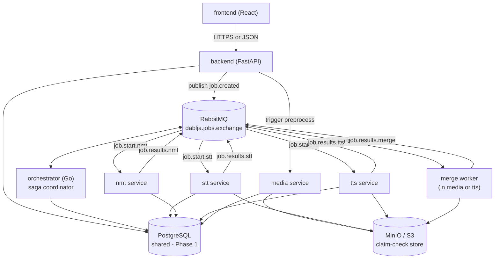
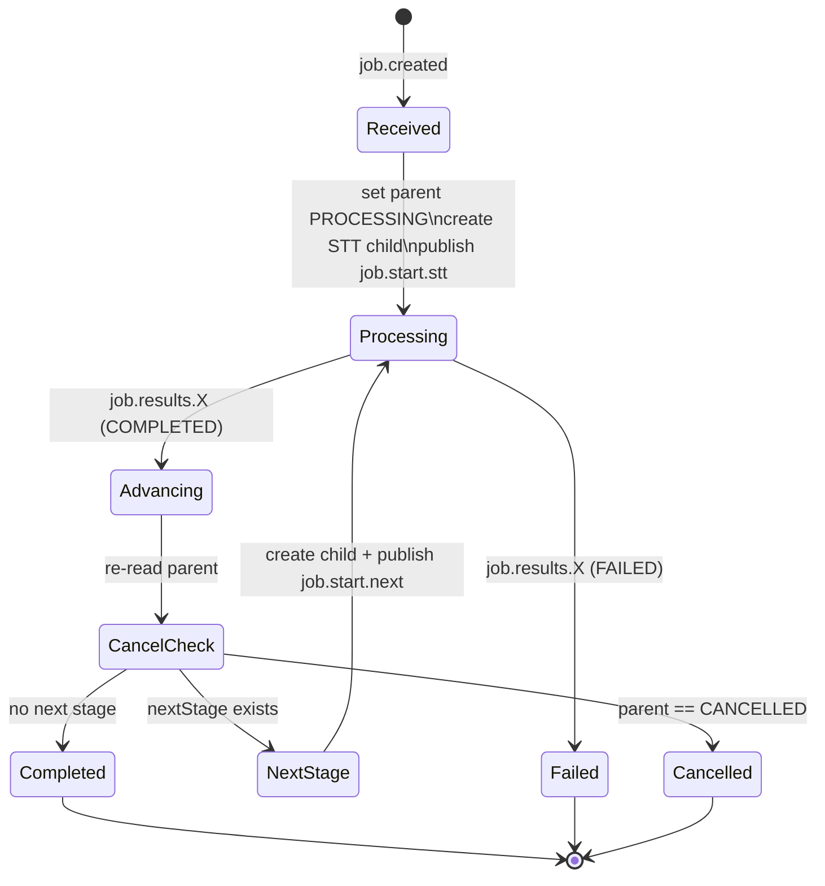
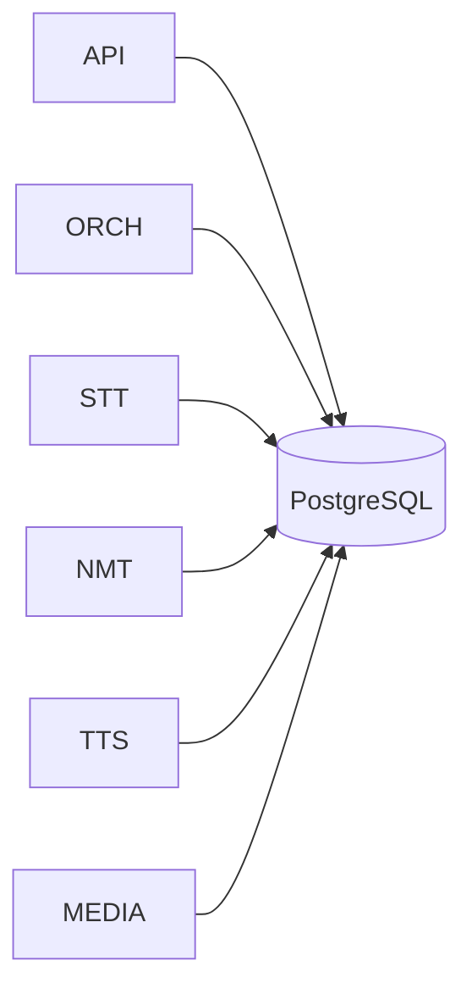

# DabljaAR — Microservices Migration Design Doc

> **Status:** Proposed
> **Author:** Engineering
> **Last updated:** June 2026
> **Supersedes target style of:** [docs/architecture.md](architecture.md) §12 (Future Roadmap)

---

## Table of Contents

1. [Goal & Scope](#1-goal--scope)
2. [Decisions (Locked)](#2-decisions-locked)
3. [Target Architecture](#3-target-architecture)
4. [Microservices Patterns Applied](#4-microservices-patterns-applied)
5. [Service Boundaries](#5-service-boundaries)
6. [Messaging Topology (RabbitMQ)](#6-messaging-topology-rabbitmq)
7. [Orchestrator Design (Saga Coordinator)](#7-orchestrator-design-saga-coordinator)
8. [Worker Design (AMQP Consumers)](#8-worker-design-amqp-consumers)
9. [End-to-End Data Flow](#9-end-to-end-data-flow)
10. [Cancellation, Retries & Failure Handling](#10-cancellation-retries--failure-handling)
11. [Data Ownership Plan](#11-data-ownership-plan)
12. [Migration Plan (Phased)](#12-migration-plan-phased)
13. [Kubernetes & Scaling](#13-kubernetes--scaling)
14. [Risks & Mitigations](#14-risks--mitigations)
15. [Appendix: Message Contracts](#15-appendix-message-contracts)

---

## 1. Goal & Scope

Migrate DabljaAR from a Celery-driven modular monolith to an event-driven microservices architecture composed of six independently deployable units:

```
frontend · backend · media · stt · nmt · tts
```

The dubbing pipeline (`STT → NMT → TTS → merge`) is coordinated by the existing Go **orchestrator** over **RabbitMQ**, replacing Celery (`apply_async` chains, the NMT `chord`, and the TTS Redis counter) entirely.

**Primary objective:** ship the migration as fast as possible while keeping the door open for stricter data isolation later.

**In scope:** transport swap (Celery → AMQP), orchestrator wiring, worker refactor to consumers, NMT/TTS internal fan-out, deployment topology.

**Out of scope (this phase):** database-per-service split (Phase 3), event sourcing, frontend rewrite (stays polling-based).

---

## 2. Decisions (Locked)

These were explicitly chosen and drive the rest of this document.

| # | Decision | Choice | Rationale |
|---|----------|--------|-----------|
| D1 | Job/result persistence (Phase 1) | **Workers write DB directly** | Reuse existing `BaseJobTask` DB logic; only the transport changes. Fastest path. |
| D2 | Celery replacement | **Event-driven: RabbitMQ + Go orchestrator** | ~80% already built; fits long-running jobs. |
| D3 | NMT fan-out | **Internal to NMT service** | One message in, full translation out. No distributed chord. |
| D4 | TTS fan-out | **Internal to TTS service** | One message in, combined audio out. No Redis counter. |
| D5 | Partial pipelines (`output_type`) | **Orchestrator reads `output_type` and decides next stage** | Dynamic transition table matches current product behavior. |
| D6 | Media preprocessing | **Pre-pipeline step** | Backend triggers media, then publishes `job.created`. Orchestrator stays focused on dubbing. |
| D7 | Stage child-job creation | **Orchestrator creates next child job**, then publishes `job.start.X` with that child `job_id` | Centralizes the state machine; workers stay dumb. |
| D8 | Cancellation | **Cooperative cancel via DB flag** | Orchestrator skips cancelled pipelines; workers check at stage/segment boundaries. |
| D9 | Database (Phase 1) | **Shared DB** (Option 1) → **Orchestrator-owned** (Option 3) after K8s deploy | Defer the hard split; unblock everything else now. |

---

## 3. Target Architecture



Key change vs today: stages no longer call each other (`apply_async`). Each worker only knows how to consume `job.start.<stage>` and publish `job.results.<stage>`. The orchestrator is the only component that knows pipeline order.

---

## 4. Microservices Patterns Applied

This is the explicit pattern catalog the design follows, with where each is realized.

| Pattern | Where / How |
|---------|-------------|
| **Orchestration-based Saga** | The Go orchestrator is the saga coordinator. Each stage is a saga step; it advances on `job.results.*` and marks the parent `FAILED` on any step failure. See [§7](#7-orchestrator-design-saga-coordinator). |
| **Asynchronous Messaging / Event-Driven** | All inter-service pipeline communication is AMQP messages on a topic exchange. No synchronous stage-to-stage HTTP. |
| **Competing Consumers** | Each stage queue (`job.start.stt`, etc.) is consumed by N identical worker replicas. Throughput scales by adding replicas. |
| **Claim Check** | Large artifacts (audio, video, TTS wavs) live in MinIO/S3. Messages carry only **object keys + `job_id`**, never payloads. Keeps messages small and the broker fast. |
| **Correlation Identifier** | `job_id` correlates every message across stages and DB rows. |
| **Idempotent Consumer** | Workers must tolerate redelivery (RabbitMQ at-least-once). Re-running a stage on the same `job_id` overwrites the same DB row / S3 key deterministically. See [§10](#10-cancellation-retries--failure-handling). |
| **Dead Letter Queue** | Poison messages route to `dablja.jobs.dlx → orchestrator.dlq` (already implemented in `manager.go`). |
| **Health Check API** | Orchestrator exposes `/health` and `/readiness`; every service gets the same for K8s probes. |
| **Externalized Configuration** | All endpoints/secrets via env vars (existing `Settings` pattern); K8s `ConfigMap`/`Secret`. |
| **Strangler Fig** | Migration is incremental: workers move off Celery one queue at a time while the monolith keeps running. See [§12](#12-migration-plan-phased). |
| **Shared Database (transitional)** | Phase 1 only — explicitly acknowledged as a transitional anti-pattern, retired in Phase 3 (Database-per-Service / orchestrator-owned). |
| **API Gateway / Ingress** | K8s Ingress fronts `backend` and `frontend`; AI services are cluster-internal only. |

> **Note on Saga compensation:** dubbing stages are *forward-only* with no external side effects to undo (outputs are just S3 objects). So "compensation" is simply: mark the pipeline `FAILED`, stop advancing, and leave orphaned S3 objects for a GC sweep. We do **not** need rollback transactions.

---

## 5. Service Boundaries

| Service | Owns | Inbound | Outbound | Runtime |
|---------|------|---------|----------|---------|
| **frontend** | UI | — | REST to backend | React/Vite |
| **backend** | auth, users, billing, videos, job creation, status reads | REST | `job.created`, media trigger, DB | FastAPI |
| **media** | FFmpeg preprocess (audio extract, HLS, thumbnail), final merge | media trigger / `job.start.merge` | DB, S3, `job.results.merge` | Python |
| **stt** | Whisper transcription | `job.start.stt` | DB, `job.results.stt` | Python + faster-whisper |
| **nmt** | NLLB translation incl. internal segment fan-out + Groq length adjust | `job.start.nmt` | DB, `job.results.nmt` | Python + transformers |
| **tts** | SILMA synthesis incl. internal per-segment loop + audio combine | `job.start.tts` | DB, S3, `job.results.tts` | Python + silma-tts |
| **orchestrator** | pipeline state machine, child-job creation, parent status | `job.created`, `job.results.*` | `job.start.*`, DB | Go |

Mapping from current modules: `app/stt` → stt, `app/nmt` → nmt, `app/tts` + `app/dubbing` → tts, `app/media` → media, everything else (`core`, `tasks`, `jobs` API, `media` routers) stays in backend.

---

## 6. Messaging Topology (RabbitMQ)

Reuses the exchange/DLX already declared in [orchestrator/internal/pipeline/manager.go](../orchestrator/internal/pipeline/manager.go).

```
Exchange:  dablja.jobs.exchange   (topic, durable)
DLX:       dablja.jobs.dlx        (direct, durable)

Routing keys (orchestrator -> workers):
  job.start.media   job.start.stt   job.start.nmt   job.start.tts   job.start.merge

Routing keys (workers -> orchestrator):
  job.results.media job.results.stt job.results.nmt job.results.tts job.results.merge

Trigger (backend -> orchestrator):
  job.created
```

| Queue | Bound to | Consumer | Notes |
|-------|----------|----------|-------|
| `orchestrator.new_jobs` | `job.created` | orchestrator | existing |
| `orchestrator.results` | `job.results.*` | orchestrator | existing |
| `stage.stt` | `job.start.stt` | stt workers | new |
| `stage.nmt` | `job.start.nmt` | nmt workers | new |
| `stage.tts` | `job.start.tts` | tts workers | new |
| `stage.media` | `job.start.media` | media workers | new (preprocess optional path) |
| `stage.merge` | `job.start.merge` | merge worker | new |
| `orchestrator.dlq` | DLX | manual / alerting | existing |

**QoS:** every stage queue uses `prefetch=1` (one unacked message per consumer). This is the natural backpressure mechanism — slow workers leave messages safely in RabbitMQ instead of in RAM.

**Persistence:** all messages published `DeliveryMode=Persistent` (already done in `publishNextJob`).

---

## 7. Orchestrator Design (Saga Coordinator)

### 7.1 What changes from today

The current `manager.go` has a **fixed** transition table:

```20:26:orchestrator/internal/pipeline/manager.go
var nextStageRoutes = map[db.JobType]string{
	db.JobTypeSTTTranscribe: "job.start.nmt",
	db.JobTypeNMTTranslate:  "job.start.tts",
	db.JobTypeTTSSynthesize: "job.start.merge",
	// JobTypeDubbingMerge is the final stage — no next route.
}
```

Three changes are required:

1. **Dynamic next-stage resolution (D5).** Replace the static map with a function that reads the parent job's `output_type` and returns the next stage (or "done").
2. **Child-job creation (D7).** Before publishing `job.start.X`, the orchestrator inserts a child `Job` row of the correct `job_type` (status `QUEUED`, `parent_job_id` set) and publishes that **child** `job_id`.
3. **Cancellation gate (D8).** Before advancing, re-read the parent; if `CANCELLED`, stop.

### 7.2 Dynamic transition table

`output_type` → ordered stage list (computed once, walked per result):

| `output_type` | Stage sequence |
|---------------|----------------|
| `uploadOnly` | media only (no dubbing job created) |
| `captionsOnly` | STT → done |
| `captionsAndTranslation` | STT → NMT → done |
| `translationAndTTS` | STT → NMT → TTS → done |
| `fullDubbing` | STT → NMT → TTS → merge → done |

Resolution logic (Go, pseudocode):

```go
var stageOrder = map[string][]db.JobType{
    "captionsOnly":           {JobTypeSTTTranscribe},
    "captionsAndTranslation": {JobTypeSTTTranscribe, JobTypeNMTTranslate},
    "translationAndTTS":      {JobTypeSTTTranscribe, JobTypeNMTTranslate, JobTypeTTSSynthesize},
    "fullDubbing":            {JobTypeSTTTranscribe, JobTypeNMTTranslate, JobTypeTTSSynthesize, JobTypeDubbingMerge},
}

var startRoute = map[db.JobType]string{
    JobTypeSTTTranscribe: "job.start.stt",
    JobTypeNMTTranslate:  "job.start.nmt",
    JobTypeTTSSynthesize: "job.start.tts",
    JobTypeDubbingMerge:  "job.start.merge",
}

// nextStage returns the stage after `current`, or ("", false) if pipeline is done.
func nextStage(outputType string, current db.JobType) (db.JobType, bool) {
    seq := stageOrder[outputType]
    for i, s := range seq {
        if s == current && i+1 < len(seq) {
            return seq[i+1], true
        }
    }
    return "", false
}
```

### 7.3 Orchestrator state machine



The existing `handleNewJob` / `handleResult` / `markParentJob` / `publishNextJob` functions in `manager.go` stay; only `handleResult`'s advancement block is rewritten to: (a) check cancel, (b) resolve next stage from `output_type`, (c) create child job, (d) publish.

---

## 8. Worker Design (AMQP Consumers)

### 8.1 Generic shape

Every Python worker drops `BaseJobTask`/Celery and becomes a thin AMQP consumer. The **inference code is unchanged** — only the wrapper changes.

```python
# shared consumer skeleton (per service)
async def on_message(message: aio_pika.IncomingMessage):
    payload = json.loads(message.body)          # {"job_id": "..."}
    job_id = payload["job_id"]

    if is_cancelled(job_id):                     # D8 cooperative cancel
        await message.ack()
        return

    try:
        job = load_job(job_id)                   # read input_data + video_task from DB
        mark_processing(job_id)
        result = run_stage(job)                  # existing inference logic
        persist_result(job_id, result)           # D1 worker writes DB directly
        await publish_result(f"job.results.{STAGE}", {
            "job_id": job_id, "job_type": JOB_TYPE,
            "status": "COMPLETED", "output_data": result.summary,
        })
        await message.ack()
    except Exception as e:
        mark_failed(job_id, str(e))
        await publish_result(f"job.results.{STAGE}", {
            "job_id": job_id, "job_type": JOB_TYPE,
            "status": "FAILED", "error": str(e),
        })
        await message.ack()                      # ack: failure already reported to orchestrator
```

> Failures are **reported as a result message** (`status: FAILED`), not Nack'd. Nack/requeue is reserved for *infrastructure* faults (DB unreachable, etc.) where a retry could succeed. This avoids infinite redelivery loops on deterministic errors.

The DB helpers (`mark_processing`, `persist_result`, `mark_failed`) are lifted directly from the existing `_patch_job` / `_patch_task` in [backend/app/jobs/tasks/base.py](../backend/app/jobs/tasks/base.py) — reused verbatim, satisfying D1.

### 8.2 NMT — internal fan-out (D3)

The current distributed `chord(group(...))` in [backend/app/jobs/tasks/nmt.py](../backend/app/jobs/tasks/nmt.py) is **removed**. The NMT worker reads all STT segments and translates them in-process:

```python
def run_stage(job):
    segments = job.video_task.stt_segments
    with ThreadPoolExecutor(max_workers=NMT_INTERNAL_CONCURRENCY) as pool:
        translated = list(pool.map(translate_one_segment, segments))
    # length adjustment (Groq) stays as-is, per segment
    return NmtResult(translated_segments=translated,
                     translated_transcript=join(translated))
```

One `job.start.nmt` message → one `job.results.nmt` message. No callback task, no chord bookkeeping.

### 8.3 TTS — internal segments + combine (D4)

The Redis completion counter (`r.incr(counter_key)` in [backend/app/jobs/tasks/pipeline.py](../backend/app/jobs/tasks/pipeline.py)) is **removed**. The TTS worker synthesizes every segment and combines, all within one message:

```python
def run_stage(job):
    segs = job.video_task.segments        # translated segments w/ timing
    keys = [synthesize_segment(s) for s in segs]   # or bounded pool
    combined_key = combine_audio(keys, timing=segs)  # existing DubbingMergeService
    return TtsResult(combined_audio_key=combined_key, segments=segs)
```

For `fullDubbing`, audio/video muxing remains a separate `merge` stage (so it can run on the media service near FFmpeg). For `translationAndTTS`, TTS is the terminal stage.

### 8.4 Cancellation checkpoints

NMT/TTS loops should check `is_cancelled(job_id)` between segments so a long job stops promptly, not just at stage boundaries.

---

## 9. End-to-End Data Flow

`fullDubbing` happy path:

```mermaid
sequenceDiagram
    participant FE as frontend
    participant API as backend
    participant ME as media
    participant MQ as RabbitMQ
    participant OR as orchestrator
    participant STT as stt
    participant NMT as nmt
    participant TTS as tts
    participant MG as merge
    participant DB as PostgreSQL
    participant S3 as MinIO

    FE->>API: POST /videos/upload (+ output_type)
    API->>ME: preprocess(video)
    ME->>S3: store audio key
    ME->>DB: update video.audio_path
    API->>DB: create parent job (FULL_DUBBING_PIPELINE) + VideoTask
    API->>MQ: publish job.created {parent_job_id}

    MQ->>OR: job.created
    OR->>DB: parent PROCESSING; create STT child
    OR->>MQ: job.start.stt {stt_job_id}

    MQ->>STT: job.start.stt
    STT->>S3: read audio
    STT->>DB: write transcript + stt_segments
    STT->>MQ: job.results.stt {COMPLETED}

    MQ->>OR: job.results.stt
    OR->>DB: (cancel check) create NMT child
    OR->>MQ: job.start.nmt

    MQ->>NMT: job.start.nmt
    NMT->>DB: read stt_segments; write translated_segments
    NMT->>MQ: job.results.nmt {COMPLETED}

    MQ->>OR: job.results.nmt
    OR->>MQ: job.start.tts

    MQ->>TTS: job.start.tts
    TTS->>S3: write per-segment wavs + combined audio
    TTS->>DB: write combined_audio_key
    TTS->>MQ: job.results.tts {COMPLETED}

    MQ->>OR: job.results.tts
    OR->>MQ: job.start.merge

    MQ->>MG: job.start.merge
    MG->>S3: write dubbed video
    MG->>DB: write dubbed_video_path
    MG->>MQ: job.results.merge {COMPLETED}

    MQ->>OR: job.results.merge
    OR->>DB: parent COMPLETED (progress 100)

    FE->>API: GET /tasks/{id} (poll) -> COMPLETED
```

Frontend continues to **poll** `GET /api/tasks/{id}` and `GET /api/jobs/{id}` — unchanged from today.

---

## 10. Cancellation, Retries & Failure Handling

### 10.1 Cancellation (D8 — cooperative)

```
POST /api/jobs/{id}/cancel
  -> backend sets parent + active child status = CANCELLED in DB

Orchestrator: on each job.results.* it re-reads the parent;
              if CANCELLED -> stop, do not create/publish next stage.

Workers: check is_cancelled(job_id) at stage start and between segments;
         if cancelled -> ack and exit without producing output.
```

No broker-level revocation needed. Worst case, one already-running stage finishes its current segment before noticing the flag.

### 10.2 Retries

| Failure type | Handling |
|--------------|----------|
| Deterministic stage error (bad input, model error) | Worker reports `status: FAILED`; orchestrator marks parent `FAILED`. No requeue. |
| Transient infra error (DB/S3/broker blip) | Worker `Nack(requeue=true)` up to `max_retries` (track via `job.retry_count`); beyond that, publish `FAILED`. |
| Worker crash mid-message | Message un-acked → RabbitMQ redelivers to another replica (at-least-once). Idempotent consumer makes reprocessing safe. |
| Poison message (unparseable) | Routed to `orchestrator.dlq` via DLX for inspection. |

### 10.3 Idempotency

Because delivery is at-least-once, every stage must be safe to run twice on the same `job_id`:
- DB writes are **upserts on the same row** (keyed by `job_id` / `video_task`).
- S3 keys are **deterministic** (derived from `job_id` + stage), so re-runs overwrite rather than duplicate.

---

## 11. Data Ownership Plan

### Phase 1 — Shared DB (now, Decision D9 / Option 1)

All services share the existing PostgreSQL and write directly via the lifted `_patch_job` / `_patch_task` helpers. Zero schema change. The orchestrator inserts stage child jobs. This is a transitional **Shared Database** anti-pattern, accepted to maximize migration speed.



### Phase 3 — Orchestrator-owned job state (after K8s deploy, Option 3)

Workers stop writing `jobs`/`video_tasks`. They return results in messages; the orchestrator becomes the **single writer** for pipeline state. Backend reads status via DB read-replica or an orchestrator HTTP endpoint. Workers become fully stateless. This removes the dual-writer coupling (and the `CeleryTaskID` artifact in [orchestrator/internal/db/db.go](../orchestrator/internal/db/db.go)).

> Phase 2 (between) is purely deployment: containerize each worker and roll onto Kubernetes with KEDA. No data-model change.

---

## 12. Migration Plan (Phased)

> **See also:** [docs/microservices_lld.md](microservices_lld.md) — canonical Phase 1/2 LLD.

Incremental **Strangler Fig** — the monolith keeps running until each queue is cut over.

### Phase 1 — Full-app LLD + STT/NMT validation ✅ COMPLETED

- [x] Freeze message contracts ([§15](#15-appendix-message-contracts)).
- [x] Extract shared `dablja_worker.py` copies into `libs/dablja-worker` installable package.
- [x] `stt-service`: consumer, idempotency, cancel, DB writes, result payload — unit tests passing.
- [x] `nmt-service`: fan-out, cancel watcher, per-`output_type` status rules — extended unit tests.
- [x] `docker-compose.test.yml` created; `helpers.py` port fixed (5673 → 5672).
- [x] E2E scripts: `test_e2e_captions_only.sh`, `test_e2e_captions_and_translation.sh`.
- [x] `backend-tests.yml` re-enabled; `go-tests.yml` added for orchestrator + stt/nmt unit tests.
- [x] `docs/microservices_lld.md` written with full-app LLD (including Phase 2 TTS/merge specs).

Canonical LLD: [docs/microservices_lld.md](microservices_lld.md)

### Phase 2 — TTS service + merge worker + Celery decommission (PENDING)

- [ ] Build `tts-service` (port 8003) — extract SilmaTTSModelManager + audio_combine from backend.
- [ ] Build `merge-service` (port 8004) — extract video mux from DubbingMergeService.
- [ ] Orchestrator: restore `JobTypeDubbingMerge` in `stageOrder["fullDubbing"]`.
- [ ] Remove `tts_bridge.py`, Celery TTS tasks, Redis counter from backend.
- [ ] Decommission Celery/Redis/Flower; ship `docker-compose.microservices.prod.yml`.
- [ ] Validate `translationAndTTS`, `fullDubbing`, cancel mid-TTS E2E.

### Phase 3 (Post-K8s) — Kubernetes + data ownership

- [ ] Containerize each service; deploy with KEDA ([§13](#13-kubernetes--scaling)).
- [ ] Execute Phase 3 data ownership move ([§11](#11-data-ownership-plan)).

---

## 13. Kubernetes & Scaling

| Service | Autoscaler | Signal | min/max |
|---------|-----------|--------|---------|
| backend | HPA | CPU + RPS | 2 / 12 |
| orchestrator | HPA | CPU | 1 / 3 |
| media | KEDA | `stage.media` depth | 0 / 8 |
| stt | KEDA | `stage.stt` depth | 1 / 4 |
| nmt | KEDA | `stage.nmt` depth | 1 / 6 |
| tts | KEDA | `stage.tts` depth | 1 / 4 |

Principles (detail in the scaling discussion already on record):
- **KEDA** for queue workers (reacts to backlog before CPU spikes); **HPA** for the stateless API/orchestrator.
- AI workers keep `minReplicaCount: 1` (model cold start is minutes); media can scale to zero.
- Shared **ReadWriteMany PVC** for `/model-cache` so replicas don't each re-download models.
- GPU workers: `maxReplicaCount` must not exceed GPU inventory (extra pods stay `Pending`).
- `PodDisruptionBudget: minAvailable 1` per AI service; topology spread across nodes.

---

## 14. Risks & Mitigations

| Risk | Impact | Mitigation |
|------|--------|------------|
| Dual writers on `jobs` (Phase 1) | Schema change needs coordinated Go+Python deploy | Keep schema frozen during migration; retire in Phase 3. |
| At-least-once redelivery | Duplicate processing | Idempotent consumers; deterministic S3 keys ([§10.3](#103-idempotency)). |
| In-flight cancel latency | Stage finishes before noticing cancel | Per-segment cancel checks in NMT/TTS ([§8.4](#84-cancellation-checkpoints)). |
| Lost progress granularity | Coarser than per-segment Celery updates | Orchestrator sets coarse progress per stage; workers may still patch `progress` mid-stage. |
| Orphaned S3 objects on failure | Storage bloat | Periodic GC sweep keyed by failed/cancelled `job_id`. |
| Model cold start under load | Slow first response after scale-up | KEDA `min=1` + shared model PVC. |
| Big-bang temptation | Risky cutover | Strangler Fig, one queue at a time, validate shortest pipelines first. |

---

## 15. Appendix: Message Contracts

### `job.created` (backend → orchestrator)

```json
{ "job_id": "<parent FULL_DUBBING_PIPELINE uuid>" }
```

### `job.start.<stage>` (orchestrator → worker)

```json
{ "job_id": "<child stage job uuid>" }
```

Workers load all input (S3 keys, params, prior-stage output) from the DB via `job_id` — **Claim Check**: no payloads on the wire.

### `job.results.<stage>` (worker → orchestrator)

Matches the existing `WorkerResultPayload` in [orchestrator/internal/pipeline/manager.go](../orchestrator/internal/pipeline/manager.go):

```json
{
  "job_id": "<child stage job uuid>",
  "job_type": "STT_TRANSCRIBE | NMT_TRANSLATE | TTS_SYNTHESIZE | DUBBING_MERGE",
  "status": "COMPLETED | FAILED",
  "output_data": { "...": "small summary / keys only" },
  "error": "present only when FAILED"
}
```

> `output_data` carries only references and small summaries (e.g. `combined_audio_key`, segment counts) — never raw transcripts/audio. Full results live in `video_tasks` / S3.
