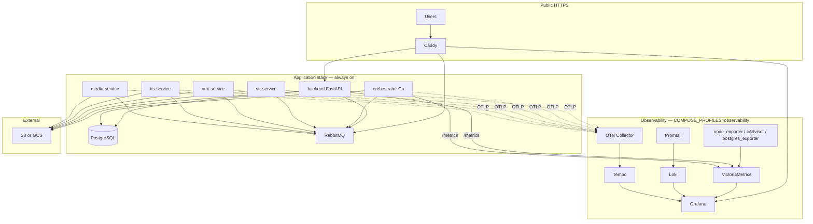

# DabljaAR Production Setup Guide

This document explains the **current production architecture** on a single GCP VM: which tools run, why each exists, how the pieces connect, and the **manual steps** required to bring the stack online.

For day-to-day LogQL/PromQL queries and dashboard UIDs, see [observability.md](observability.md). For deploy troubleshooting, see [deployment.md](deployment.md) and [runbook.md](runbook.md).

---

## Table of contents

1. [High-level overview](#high-level-overview)
2. [Architecture diagram](#architecture-diagram)
3. [Docker Compose layout](#docker-compose-layout)
4. [Application stack](#application-stack)
5. [Observability stack (optional)](#observability-stack-optional)
6. [Application instrumentation](#application-instrumentation)
7. [Networking, DNS, and TLS](#networking-dns-and-tls)
8. [Secrets and environment variables](#secrets-and-environment-variables)
9. [Manual production setup (step by step)](#manual-production-setup-step-by-step)
10. [Automated deploy (GitHub Actions)](#automated-deploy-github-actions)
11. [Day-2 operations](#day-2-operations)
12. [What is required vs optional](#what-is-required-vs-optional)
13. [Related files](#related-files)

---

## High-level overview

DabljaAR production runs as a **Docker Compose microservices stack** on one VM:

| Layer | Purpose |
|-------|---------|
| **Edge** | Caddy terminates TLS and serves the React SPA + API reverse proxy |
| **API** | FastAPI backend (auth, jobs, uploads) |
| **Pipeline** | Go orchestrator + Python AI workers (STT → NMT → TTS → media merge) over RabbitMQ |
| **Data** | PostgreSQL (job state), external S3/GCS (media + models) |
| **Observability (optional)** | Self-hosted LGTM stack: Loki, Grafana, VictoriaMetrics, Tempo |

The dubbing pipeline is **message-driven** (RabbitMQ), not Celery. The website can serve traffic while AI workers are still warming models — jobs queue until workers become ready.

---

## Architecture diagram



**Important:** Application services do **not** `depends_on` observability containers. If Loki, Tempo, or Grafana are down, the pipeline still runs.

---

## Docker Compose layout

Production uses **two compose files**, always referenced together:

| File | Role |
|------|------|
| [`docker-compose.microservices.prod.yml`](../docker-compose.microservices.prod.yml) | Core app: Caddy, Postgres, RabbitMQ, backend, orchestrator, AI workers |
| [`docker-compose.observability.yml`](../docker-compose.observability.yml) | LGTM stack + exporters (profile-gated) |

The helper script [`infra/scripts/lib/compose-env.sh`](../infra/scripts/lib/compose-env.sh) sets:

```bash
source infra/scripts/lib/compose-env.sh
# $COMPOSE = docker compose --env-file .env.production \
#   -f docker-compose.microservices.prod.yml \
#   -f docker-compose.observability.yml
```

### Opt-in observability with Compose profiles

Observability services declare `profiles: [observability]`. They start only when `.env.production` contains:

```env
COMPOSE_PROFILES=observability
```

Docker Compose reads `COMPOSE_PROFILES` from the env file automatically. No custom shell toggle is required.

| `COMPOSE_PROFILES` | What runs |
|--------------------|-----------|
| unset / empty | App stack only (9 services) |
| `observability` | App stack + Loki, Grafana, Tempo, VictoriaMetrics, exporters, etc. |

---

## Application stack

### Services (always on)

| Service | Container | Tool / image | Goal |
|---------|-----------|--------------|------|
| **caddy** | `dabljaar_caddy` | [Caddy 2.10](https://caddyserver.com/) | Automatic HTTPS (ACME), reverse proxy for API/SPA/Grafana/RabbitMQ UI |
| **postgres** | `dabljaar_postgres` | PostgreSQL 16 | Job metadata, users, pipeline state |
| **rabbitmq** | `dabljaar_rabbitmq` | RabbitMQ 3 + management | Async job queue; orchestrator ↔ workers messaging |
| **backend** | `dabljaar_backend` | FastAPI (Python 3.12) | REST API, auth, job creation, publishes `job.created` |
| **orchestrator** | `dabljaar_orchestrator` | Go | Pipeline state machine; dispatches stages via RabbitMQ |
| **stt-service** | `dabljaar_stt_service` | faster-whisper | Speech-to-text stage |
| **nmt-service** | `dabljaar_nmt_service` | NLLB / Groq fallback | Neural machine translation stage |
| **tts-service** | `dabljaar_tts_service` | OmniVoice / TTS models | Text-to-speech stage |
| **media-service** | `dabljaar_media_service` | FFmpeg / merge logic | Preprocess + final audio merge |

### Supporting config (not separate containers)

| Path | Goal |
|------|------|
| [`Caddyfile.production`](../Caddyfile.production) | Committed TLS + routing config (app, RabbitMQ, Grafana blocks) |
| [`infra/rabbitmq/enabled_plugins`](../infra/rabbitmq/enabled_plugins) | Enables `rabbitmq_prometheus` for queue metrics when observability is on |
| [`infra/rabbitmq/rabbitmq.conf`](../infra/rabbitmq/rabbitmq.conf) | RabbitMQ tuning |

### Pipeline flow (summary)

1. User uploads media via **backend** → stored in **S3/GCS**.
2. Backend publishes `job.created` on **RabbitMQ**.
3. **Orchestrator** consumes the event and drives STT → NMT → TTS → merge by publishing to stage queues.
4. Each **worker** processes its queue, writes results to Postgres, publishes `job.results.*`.
5. **Media-service** produces the final dubbed output.

See [pipeline.md](pipeline.md) for message formats and stage details.

---

## Observability stack (optional)

When `COMPOSE_PROFILES=observability` is set, these containers start. Together they form a self-hosted **LGTM** bundle (Loki, Grafana, VictoriaMetrics/M metrics, Tempo).

### Observability services

| Service | Container | Tool | Goal |
|---------|-----------|------|------|
| **loki** | `dabljaar_loki` | [Grafana Loki 3.4](https://grafana.com/oss/loki/) | Log storage and LogQL queries |
| **promtail** | `dabljaar_promtail` | [Promtail 3.4](https://grafana.com/docs/loki/latest/send-data/promtail/) | Ships Docker container stdout → Loki; labels logs by `service` |
| **victoriametrics** | `dabljaar_victoriametrics` | [VictoriaMetrics 1.109](https://victoriametrics.com/) | Prometheus-compatible metrics TSDB + scraper |
| **tempo-init** | `dabljaar_tempo_init` | One-shot init | Fixes volume ownership for Tempo (UID 10001) |
| **tempo** | `dabljaar_tempo` | [Grafana Tempo 2.7](https://grafana.com/oss/tempo/) | Distributed trace storage |
| **otel-collector** | `dabljaar_otel_collector` | [OTel Collector 0.120](https://opentelemetry.io/docs/collector/) | Receives OTLP from apps; batches, samples, forwards traces → Tempo |
| **grafana** | `dabljaar_grafana` | [Grafana 11.5](https://grafana.com/) | Dashboards, Explore, unified alerting UI |
| **node_exporter** | `dabljaar_node_exporter` | [Prometheus node_exporter](https://github.com/prometheus/node_exporter) | Host CPU, RAM, disk metrics |
| **cadvisor** | `dabljaar_cadvisor` | [cAdvisor](https://github.com/google/cadvisor) | Per-container resource usage |
| **postgres_exporter** | `dabljaar_postgres_exporter` | [postgres_exporter](https://github.com/prometheus-community/postgres_exporter) | Postgres connection / stats metrics |

### Config locations

| Component | Config path |
|-----------|-------------|
| Loki | [`infra/observability/loki-config.yml`](../infra/observability/loki-config.yml) |
| Promtail | [`infra/observability/promtail-config.yml`](../infra/observability/promtail-config.yml) |
| VictoriaMetrics scrape | [`infra/observability/victoriametrics/scrape.yml`](../infra/observability/victoriametrics/scrape.yml) |
| Tempo | [`infra/observability/tempo-config.yml`](../infra/observability/tempo-config.yml) |
| OTel Collector | [`infra/observability/otel-collector.yml`](../infra/observability/otel-collector.yml) |
| Grafana datasources | [`infra/observability/grafana/provisioning/datasources.yml`](../infra/observability/grafana/provisioning/datasources.yml) |
| Grafana dashboards | [`infra/observability/grafana/dashboards/`](../infra/observability/grafana/dashboards/) |
| Alert rules | [`infra/observability/grafana/provisioning/alerting/rules.yml`](../infra/observability/grafana/provisioning/alerting/rules.yml) |

### Three pillars — what each answers

| Pillar | Tools | Typical questions |
|--------|-------|-------------------|
| **Logs** | Promtail → Loki → Grafana | "What happened to job `abc-123`?" / "Which service logged this error?" |
| **Metrics** | App `/metrics` + exporters → VictoriaMetrics → Grafana | "Is the DLQ growing?" / "What is stage p95 latency?" / "Disk almost full?" |
| **Traces** | App OTel SDK → Collector → Tempo → Grafana | "How long did STT take for this request?" / "Cross-service path for one job" |

### Retention and memory (defaults)

| Component | Retention | `mem_limit` |
|-----------|-----------|-------------|
| Loki | 7 days | 512m |
| VictoriaMetrics | 15 days | 512m |
| Tempo | 3 days | 384m |
| Grafana | — | 256m |
| Promtail | — | 128m |
| OTel Collector | — | 128m |

---

## Application instrumentation

Instrumentation is **built into the app code** and enabled via environment variables in the base compose file. It is safe when observability is off (OTLP export fails silently; no crash).

| Signal | Where | How |
|--------|-------|-----|
| **JSON logs** | backend, workers | `LOG_JSON_FORMAT=true`, `SERVICE_NAME=<name>` — fields include `job_id`, `trace_id`, `level` |
| **Prometheus metrics** | backend, orchestrator, workers | HTTP `GET /metrics` — e.g. `dablja_jobs_completed_total`, `dablja_stage_duration_seconds` |
| **OpenTelemetry traces** | backend, orchestrator, workers | OTLP gRPC → `otel-collector:4317`; 20% head sampling; W3C `traceparent` over RabbitMQ |

Key source files:

- Backend: [`backend/app/shared/telemetry.py`](../backend/app/shared/telemetry.py)
- Workers: [`libs/dablja-worker/dablja_worker/tracing.py`](../libs/dablja-worker/dablja_worker/tracing.py), [`logging.py`](../libs/dablja-worker/dablja_worker/logging.py)
- Orchestrator: [`orchestrator/internal/tracing/tracing.go`](../orchestrator/internal/tracing/tracing.go)

Disable tracing locally:

```bash
OTEL_SDK_DISABLED=true
```

---

## Networking, DNS, and TLS

### Public URLs (via Caddy)

Assume `DOMAIN=app.yourbrand.tech` in `.env.production`:

| URL | Backend | Auth |
|-----|---------|------|
| `https://app.yourbrand.tech` | SPA + `/api/*` → backend | App JWT/session |
| `https://rabbitmq.app.yourbrand.tech` | RabbitMQ management UI | `RABBITMQ_DEFAULT_USER` / `RABBITMQ_DEFAULT_PASS` |
| `https://grafana.app.yourbrand.tech` | Grafana (when profile on) | Caddy basic auth + Grafana admin login |

Caddy obtains certificates via ACME using `ACME_EMAIL`.

### Internal-only (Docker network)

Not exposed publicly: Loki `:3100`, VictoriaMetrics `:8428`, Tempo `:3200`, OTLP `:4317`.

### DNS (Terraform / Cloudflare)

Terraform can create:

- `app.yourbrand.tech` → VM IP
- `rabbitmq.app.yourbrand.tech` → VM IP
- `grafana.app.yourbrand.tech` → VM IP (`dns_include_grafana`, default `true`)

See [`infra/terraform/README.md`](../infra/terraform/README.md). Verify after apply:

```bash
dig +short app.yourbrand.tech
dig +short grafana.app.yourbrand.tech
```

**Note:** `Caddyfile.production` always includes the Grafana site block. If DNS points to the VM but `COMPOSE_PROFILES=observability` is not set, `https://grafana.$DOMAIN` may return **502** until Grafana is started.

---

## Secrets and environment variables

Template: [`.env.production.example`](../.env.production.example)

### Required for the app stack

| Variable | Purpose |
|----------|---------|
| `DOMAIN` | Primary site hostname (must match DNS) |
| `ACME_EMAIL` | Let's Encrypt registration email |
| `SECRET_KEY` | JWT / session signing |
| `POSTGRES_PASSWORD` | Database password |
| `RABBITMQ_URL`, `RABBITMQ_DEFAULT_PASS` | Message broker |
| `S3_ENDPOINT_URL`, `S3_ACCESS_KEY_ID`, `S3_SECRET_ACCESS_KEY` | Object storage |
| `S3_MEDIA_BUCKET`, `S3_MODELS_BUCKET` | Bucket names |

### Required when observability profile is enabled

| Variable | Purpose |
|----------|---------|
| `COMPOSE_PROFILES=observability` | Starts LGTM containers |
| `GRAFANA_ADMIN_PASSWORD` | Grafana admin UI (change from default) |
| `GRAFANA_BASIC_AUTH_HASH` | Caddy bcrypt hash in front of Grafana |

Generate the Caddy hash:

```bash
caddy hash-password --plaintext 'your-strong-password'
```

The deploy script can auto-generate `GRAFANA_BASIC_AUTH_HASH` for one run if the profile is enabled and the hash is still a placeholder.

On GCP, store the full `.env.production` in Secret Manager as `env-production` and sync to the VM before deploy.

---

## Manual production setup (step by step)

### Phase 1 — Infrastructure (Terraform)

1. Configure Terraform variables per [`infra/terraform/README.md`](../infra/terraform/README.md).
2. Set `dns_enabled = true`, `dns_app_subdomain = "app"`, `dns_include_grafana = true`.
3. Run `terraform apply`.
4. Confirm DNS:

   ```bash
   dig +short app.yourbrand.tech
   dig +short grafana.app.yourbrand.tech
   ```

5. Note outputs: VM IP, bucket names, service account emails.

### Phase 2 — Environment file

On the VM (or locally, then upload to Secret Manager):

```bash
cp .env.production.example .env.production
```

Fill in at minimum:

```env
DOMAIN=app.yourbrand.tech
ACME_EMAIL=you@yourbrand.tech
SECRET_KEY=<long-random-string>
POSTGRES_PASSWORD=<strong>
RABBITMQ_DEFAULT_PASS=<strong>
RABBITMQ_URL=amqp://dabljaar:<same-password>@rabbitmq:5672/
S3_ENDPOINT_URL=https://storage.googleapis.com
S3_ACCESS_KEY_ID=<key>
S3_SECRET_ACCESS_KEY=<secret>
S3_MEDIA_BUCKET=<from-terraform>
S3_MODELS_BUCKET=<from-terraform>
```

**Optional — enable observability:**

```env
COMPOSE_PROFILES=observability
GRAFANA_ADMIN_USER=admin
GRAFANA_ADMIN_PASSWORD=<strong>
GRAFANA_BASIC_AUTH_USER=admin
GRAFANA_BASIC_AUTH_HASH=<output of caddy hash-password>
LOG_JSON_FORMAT=true
```

### Phase 3 — Clone repo on VM

```bash
git clone -b main git@github.com:ORG/REPO.git ~/web
cd ~/web
```

Ensure the VM SSH key can pull the private repo (deploy uses the same).

### Phase 4 — Build frontend (first deploy)

The deploy script builds the frontend atomically. For a fully manual first bring-up:

```bash
cd ~/web/frontend
npm ci --legacy-peer-deps
VITE_API_BASE_URL=/api npm run build
# dist/ must exist before Caddy starts
```

Or use the deploy script (recommended) — it handles the atomic `dist.next` → `dist` swap.

### Phase 5 — Validate Caddy config

```bash
cd ~/web
docker run --rm \
  --env-file .env.production \
  -v "$(pwd)/Caddyfile.production:/etc/caddy/Caddyfile:ro" \
  caddy:2.10-alpine \
  caddy validate --config /etc/caddy/Caddyfile
```

### Phase 6 — Start the stack

```bash
cd ~/web
source infra/scripts/lib/compose-env.sh

# Infra first
$COMPOSE up -d postgres rabbitmq

# Wait for healthy, then migrate
$COMPOSE build backend
$COMPOSE run --rm --no-deps backend alembic upgrade head

# Full stack (respects COMPOSE_PROFILES from .env.production)
$COMPOSE up -d --build
```

### Phase 7 — Verify

```bash
source infra/scripts/lib/compose-env.sh
$COMPOSE ps

# API
curl -fsS "https://$(grep ^DOMAIN= .env.production | cut -d= -f2)/api/health"

# SPA
curl -fsSI "https://$(grep ^DOMAIN= .env.production | cut -d= -f2)/" | grep -i strict-transport-security

# Grafana (if profile enabled)
curl -fsS -u admin:<GRAFANA_ADMIN_PASSWORD> \
  "https://grafana.$(grep ^DOMAIN= .env.production | cut -d= -f2)/api/health"
```

### Phase 8 — Post-setup (observability)

1. Open Grafana → **Dashboards** → folder **DabljaAR** (Logs Explorer, Pipeline, Infrastructure).
2. Configure **Alerting → Contact points** (Slack, email, etc.) — rules are provisioned but channels are not.
3. Confirm RabbitMQ prometheus plugin metrics appear in VictoriaMetrics when profile is on:

   ```promql
   rabbitmq_queue_messages
   ```

---

## Automated deploy (GitHub Actions)

Normal production path:

```
push to main
  → .github/workflows/deploy-gcp.yml
  → SSH to VM
  → infra/scripts/deploy-production.sh
```

Deploy script summary:

1. Git sync to exact commit SHA
2. Validate committed `Caddyfile.production`
3. Atomic frontend build
4. Phased `$COMPOSE up -d` (infra → migrate → AI tier → backend → caddy → full reconcile)
5. Readiness gates for backend, orchestrator, workers
6. External HTTPS checks (API + SPA) — **required**
7. Grafana external check — **warning only** (does not fail deploy)

Manual trigger on VM:

```bash
cd ~/web
export DEPLOY_SHA=<full-or-short-commit-sha>
bash infra/scripts/deploy-production.sh
```

Logs: `~/web/deploy.log`

---

## Day-2 operations

### Common commands

```bash
cd ~/web
source infra/scripts/lib/compose-env.sh

$COMPOSE ps
$COMPOSE logs backend --tail=100
$COMPOSE logs orchestrator --tail=100
$COMPOSE restart stt-service

# Observability (when profile enabled)
$COMPOSE logs grafana loki tempo --tail=50
```

### Enable observability on a running VM

1. Add `COMPOSE_PROFILES=observability` and Grafana secrets to `.env.production`.
2. Upload to Secret Manager if using GCP sync.
3. Redeploy or run:

   ```bash
   source infra/scripts/lib/compose-env.sh
   $COMPOSE up -d
   ```

### Disable observability

1. Remove or comment out `COMPOSE_PROFILES=observability` in `.env.production`.
2. `$COMPOSE up -d` — profiled containers stop being managed on next reconcile.

   To remove containers and free RAM:

   ```bash
   $COMPOSE --profile observability down
   ```

### Debug a stuck job

1. **Logs:** Grafana → Explore → Loki, or:

   ```logql
   {service=~"stt|nmt|tts|media|orchestrator|backend"} |= "YOUR_JOB_ID"
   ```

2. **Queues:** RabbitMQ UI at `https://rabbitmq.$DOMAIN` — check `stage.*` queues and `orchestrator.dlq`.

3. **Metrics:** Grafana → Pipeline dashboard, or PromQL `rabbitmq_queue_messages{queue="orchestrator.dlq"}`.

4. **Traces:** Grafana → Explore → Tempo (when profile enabled).

See [runbook.md](runbook.md) for recovery procedures.

---

## What is required vs optional

| Component | Required for app? | Notes |
|-----------|-------------------|-------|
| Caddy, Postgres, RabbitMQ, backend, orchestrator, workers | **Yes** | Core pipeline |
| External S3/GCS | **Yes** | Media and model storage |
| `COMPOSE_PROFILES=observability` | No | LGTM stack |
| Grafana DNS record | No* | *Recommended if Grafana block stays in Caddyfile |
| App OTEL env vars | No | Always set in compose; harmless without collector |
| JSON logs | No | Recommended for Loki search when observability is on |

**Approximate extra RAM with observability enabled:** ~2.2 GB across Loki, VM, Tempo, Grafana, exporters.

---

## Related files

| Topic | Document / path |
|-------|-----------------|
| LogQL, PromQL, dashboards, alerts | [observability.md](observability.md) |
| Deploy troubleshooting | [deployment.md](deployment.md) |
| Incident response | [runbook.md](runbook.md) |
| Pipeline messages | [pipeline.md](pipeline.md) |
| Terraform / DNS / secrets | [infra/terraform/README.md](../infra/terraform/README.md) |
| Compose helper | [infra/scripts/lib/compose-env.sh](../infra/scripts/lib/compose-env.sh) |
| Deploy script | [infra/scripts/deploy-production.sh](../infra/scripts/deploy-production.sh) |
| Env template | [.env.production.example](../.env.production.example) |
